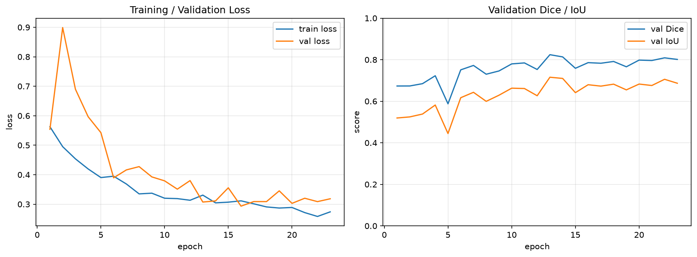
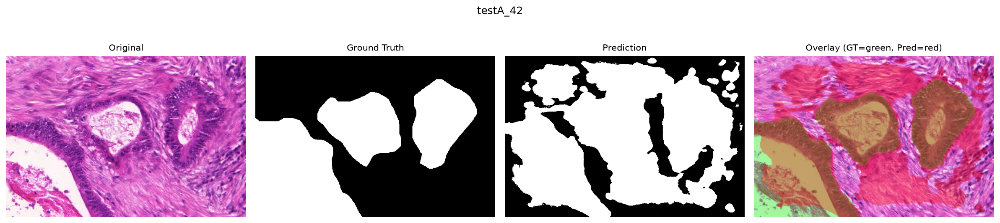

# GLaS Gland Segmentation using U-Net

A deep learning pipeline for semantic segmentation of glandular structures in colon histopathology images, built with PyTorch and a U-Net implemented from scratch. The pipeline covers dataset preprocessing, spatial data augmentation, model training with mixed precision, validation, quantitative evaluation (Dice, IoU, precision, recall), and visualization of predicted segmentation masks against ground truth.

This is a portfolio / research-education project, **not** a clinical or diagnostic tool. See [Limitations](#18-limitations).

---

## 1. Overview

This project implements a deep learning pipeline for semantic segmentation of glandular structures in colon histopathology images using a U-Net architecture and PyTorch. The system performs image preprocessing, augmentation, model training, validation, quantitative evaluation using Dice and IoU, and visualization of predicted segmentation masks.

**Dataset:** GlaS — Gland Segmentation in Colon Histology Images (MICCAI 2015 Gland Segmentation Challenge).

It was built to demonstrate applied medical image analysis / computer vision engineering: histopathology image handling, a from-scratch encoder-decoder segmentation network, a loss function chosen specifically for class imbalance in medical segmentation, and an evaluation protocol that respects the train/validation/test boundary the way a real research or industry pipeline would.

## 2. Problem Statement

Given an RGB colon histopathology image tile (H&E stained), predict a per-pixel binary segmentation mask identifying glandular regions.

- **Input:** RGB histopathology image tile.
- **Output:** Binary segmentation mask, same spatial resolution as the (resized) input.
- **Class definition:** `0` = background, `1` = gland.
- **Task type:** Semantic segmentation (all gland instances share a single foreground class; this is not instance segmentation — see [Limitations](#18-limitations) and `docs/interview_notes.md`).

## 3. Dataset

**GlaS (Gland Segmentation in Colon Histology Images)**, released for the MICCAI 2015 Gland Segmentation Challenge.

- Colon histopathology images, Hematoxylin & Eosin (H&E) stained.
- 165 image tiles total, drawn from 16 H&E-stained histological sections of benign and malignant (T3/T4 stage colorectal adenocarcinoma) tissue.
- **85 images** in the official training set (`train_1..train_85`).
- **80 images** in the official test set, split by the challenge organizers into **testA** (60 images) and **testB** (20 images).
- Each image has an expert pathologist-annotated mask. Masks are **instance-labeled** (background = 0, each individual gland = a distinct positive integer id); this project collapses that to a **binary** semantic mask (background = 0, any gland = 1), since the task here is semantic, not instance, segmentation.
- Images vary in size (they are not all a single fixed resolution) and are resized to a common training resolution (see [Preprocessing](#7-preprocessing)).
- Measured directly from the data (`scripts/prepare_data.py`): gland (foreground) pixels make up **49.6%** of the training split on average — GlaS tiles are roughly balanced between gland and background, not a rare-small-object problem (unlike, e.g., tumor-cell detection).

The dataset itself is **not included in this repository** — see [Installation](#16-installation) for how to obtain and place it locally. The official challenge page is warwick.ac.uk/fac/cross_fac/tia/data/glascontest/, and the same data is mirrored on Kaggle as `sani84/glasmiccai2015-gland-segmentation`.

**Important scope note:** GlaS image tiles are on the order of a few hundred to ~1500 pixels per side — nowhere close to a real whole-slide image (WSI), which can be 50,000 x 50,000 pixels or larger. This project is a **prototype tile-level segmentation pipeline**, not a full WSI processing system. `docs/interview_notes.md` (Q10) describes how the same core model would be embedded into a practical tiling/inference/stitching pipeline for real WSIs.

## 4. Dataset Split

The official GlaS test set (80 images) is **never** mixed into training or validation, and is **never** used to tune hyperparameters. It is touched exactly once, at final evaluation time.

The official 85-image training set is split deterministically into:

| Split | Images | Source |
|---|---|---|
| Train | 68 | 80% of the 85 official training images |
| Validation | 17 | 20% of the 85 official training images |
| Test | 80 | Official GlaS test set (testA: 60, testB: 20) — untouched during training |

The train/validation split is produced by `sklearn.model_selection.train_test_split` with `random_state=42` (`configs/config.yaml: data.split_seed`), so it is **byte-for-byte reproducible** across machines and runs. The resulting image-id lists are written to `data/splits/{train,val,test}.json` by `scripts/prepare_data.py` and are the single source of truth for which image belongs to which split — no script re-derives the split independently.

## 5. Methodology

1. Discover and pair every official image with its annotation mask; verify filename correspondence and matching spatial dimensions (`scripts/prepare_data.py`).
2. Deterministically split the 85 official training images into 68 train / 17 validation (see above); leave the 80 official test images untouched.
3. Compute per-channel normalization statistics (mean/std) from the **training split only**, to avoid leaking validation/test pixel statistics into preprocessing.
4. Train a from-scratch U-Net with a combined BCE + Dice loss, AdamW, and mixed precision (when CUDA is available).
5. Validate after every epoch; track loss, Dice, IoU, precision, recall; checkpoint the best model by validation Dice; stop early if validation Dice stalls.
6. Evaluate the single best checkpoint once on the official test set; report Dice, IoU, precision, recall, saved to `outputs/metrics/test_metrics.json`.
7. Visualize predictions (original / ground truth / prediction / overlay) for qualitative inspection.

## 6. U-Net Architecture

Implemented from scratch in `src/models/unet.py` (not imported from a library), following Ronneberger et al., *U-Net: Convolutional Networks for Biomedical Image Segmentation* (2015).

- **Encoder** — a stack of `(Conv2d -> BatchNorm2d -> ReLU) x2` blocks ("DoubleConv"), each followed by 2x2 max-pooling that halves spatial resolution and doubles channel depth. This builds a feature hierarchy from local texture up to gland-scale shape and context.
- **Bottleneck** — the deepest, lowest-resolution DoubleConv block; largest receptive field, captures global tissue context.
- **Decoder** — a mirrored stack of transposed-convolution upsampling (`ConvTranspose2d`) followed by a DoubleConv block, recovering spatial resolution stage by stage.
- **Skip connections** — at each decoder stage, the upsampled feature map is concatenated (channel-wise) with the encoder feature map of matching resolution *before* pooling discarded it. Pooling in the encoder throws away precise spatial detail (exact gland boundary location); skip connections hand that detail directly back to the decoder, which is what lets U-Net produce sharp, well-localized boundaries instead of blurry ones.
- **Output** — a final `1x1` convolution producing a single output channel of **raw logits** (no sigmoid applied inside the model). `BCEWithLogitsLoss` consumes logits directly for numerical stability; sigmoid is applied only where a probability or a thresholded mask is actually needed (metrics, inference, visualization).

Depth and channel width are configurable (`configs/config.yaml: model.depth`, `model.base_channels`); the default is the original paper's depth of 4 downsampling stages with 64 base channels.

## 7. Preprocessing

Implemented in `src/data/dataset.py` and `src/data/transforms.py`:

1. Load the RGB image (OpenCV, converted from BGR to RGB).
2. Load the corresponding annotation mask.
3. Verify image/mask correspondence: matching filename id and matching spatial dimensions (checked explicitly in `scripts/prepare_data.py` for every official pair before any training happens).
4. Binarize the mask: background = 0, any nonzero gland-instance label -> 1.
5. Resize image and mask to `configs/config.yaml: data.image_size` (default 512x512).
6. **Different interpolation per tensor type**: images use **bilinear** interpolation (appropriate for continuous RGB intensities); masks use **nearest-neighbor** interpolation. This matters — bilinear/bicubic interpolation of a categorical {0,1} mask invents fractional "in-between" values at every gland boundary that do not correspond to a real class and would corrupt the ground truth.
7. Normalize images with per-channel mean/std computed from the **training split only** (`scripts/prepare_data.py`, saved to `data/splits/normalization_stats.json`), rather than generic ImageNet statistics — H&E histology color statistics differ substantially from natural images, and the model is trained from scratch (no pretrained backbone) so there is no requirement to match ImageNet's normalization. Measured values for this split: mean `[0.785, 0.507, 0.783]`, std `[0.166, 0.246, 0.131]` (RGB, in `[0,1]` pixel space) — the high red/blue and lower green mean reflects the pink/purple H&E stain.
8. Convert both image and mask to PyTorch tensors: image as `float32` `(3, H, W)`, mask as `float32` `(1, H, W)` with values in `{0.0, 1.0}`.

## 8. Augmentation

Implemented in `src/data/transforms.py`, applied only to the training split (validation/test use a deterministic resize-and-normalize-only transform).

- Random horizontal flip
- Random vertical flip
- Random rotation (±`rotation_degrees`, default 30°)
- Mild random scaling (`scale_range`, default 0.9-1.1x), applied together with rotation via a single affine warp
- Random crop via padding + crop back to `image_size` (mild translation jitter)

These are deliberately restricted to **spatially reasonable** transformations: glands have no canonical orientation in a tissue section, so flips and rotations do not distort label semantics the way they might for, say, natural images containing text or faces. No color/stain augmentation is applied in this baseline (see [Future Work](#19-future-work)).

Image and mask always receive **identical** spatial parameters (same flip decision, same rotation angle, same crop offset) so they remain pixel-aligned; interpolation again differs (bilinear for the image, nearest-neighbor for the mask) for the same reason as in preprocessing.

## 9. Loss Function

`src/losses/dice_loss.py` implements `DiceLoss` and a combined `BCEDiceLoss = bce_weight * BCEWithLogitsLoss + dice_weight * DiceLoss` (default weights 0.5/0.5, configurable).

**Why Dice loss:** BCE treats every pixel independently and weighs all pixels equally, so it can be dominated by the easy majority class when foreground and background are imbalanced. Measured directly on this dataset, gland pixels average ~50% of a tile in aggregate, but the *per-image* proportion ranges from ~11% to ~89% across the 165 official images — a real subset of individual tiles are substantially imbalanced even though the dataset as a whole is not. Dice loss directly optimizes a differentiable approximation of the Dice overlap ratio (`2*|A∩B| / (|A|+|B|)`), which normalizes by the size of both the prediction and the target rather than by total pixel count, making it naturally more robust to per-image class imbalance than BCE.

**Why combine BCE + Dice:** Dice loss alone has noisy, unstable gradients early in training (when predictions are near-random, both the numerator and denominator of the Dice ratio are small and volatile). BCE provides a smooth, well-behaved per-pixel gradient that stabilizes early optimization, while Dice pushes directly for good region overlap. The weighted sum of the two is a standard, well-documented combination for binary medical image segmentation.

## 10. Evaluation Metrics

Implemented manually in `src/metrics/segmentation.py` from first principles (confusion-matrix counts), not via an opaque library call:

```
Dice      = 2*TP / (2*TP + FP + FN)
IoU       = TP / (TP + FP + FN)
Precision = TP / (TP + FP)
Recall    = TP / (TP + FN)
```

Predictions are thresholded at `0.5` (configurable, `configs/config.yaml: inference.threshold`) after applying sigmoid to the model's raw logits. All denominators are guarded: if a denominator is zero (no predicted and/or no actual positive pixels), the metric is defined as `1.0` rather than propagating NaN, since a zero denominator only occurs for a trivially-correct all-background-vs-all-background case.

**Dice vs. IoU:** both measure overlap between prediction and ground truth, but Dice is the harmonic mean of precision and recall and counts the intersection twice, while IoU counts it once against the full union. For any given prediction, `IoU <= Dice`, related exactly by `Dice = 2*IoU / (1 + IoU)`. Dice is more forgiving of small boundary disagreements; IoU penalizes the same disagreement more heavily.

## 11. Training

`src/training/train.py` / `scripts/train.py`.

- Optimizer: AdamW (configurable to Adam).
- Mixed precision: `torch.amp.autocast` + `torch.amp.GradScaler`, automatically enabled only when CUDA is available (falls back cleanly to full precision on CPU).
- Gradient clipping (max norm, configurable).
- Per-epoch validation; best checkpoint selected by validation Dice, saved to `checkpoints/best_model.pth`; most recent epoch always saved to `checkpoints/last_model.pth`.
- Early stopping on validation Dice plateau (`src/training/early_stopping.py`).
- Full reproducibility: Python/NumPy/PyTorch/CUDA all seeded (`src/seed.py`), deterministic cuDNN mode.
- Device selection is automatic: CUDA if available, otherwise CPU (`src/seed.py: get_device()`); no hard-coded device anywhere in the codebase.

Starting configuration (`configs/config.yaml`) — these are starting values, not claimed-optimal ones:

```yaml
image_size: 512
batch_size: 4
epochs: 50
learning_rate: 1e-4
weight_decay: 1e-5
optimizer: AdamW
seed: 42
early_stopping_patience: 10
```

## 12. Results

**These are real, measured results** from training run on this machine (single NVIDIA RTX 4060, 8GB) on the actual GlaS dataset downloaded from Kaggle (`sani84/glasmiccai2015-gland-segmentation`), using the exact 68/17/80 split described above. Every number below is reproducible by running the commands in [Usage](#17-usage) with the corresponding config file and `training.seed: 42`. Full per-image breakdowns are in each experiment's `test_metrics.json`.

### Experiment 1 — Baseline U-Net (`configs/config.yaml`)

Augmentation enabled, BCE + Dice loss. Early stopping triggered at epoch 23 (best epoch: 13).

| Metric | Value |
|---|---|
| Validation Dice | 0.8241 |
| Validation IoU | 0.7156 |
| Test Dice | 0.7787 (σ=0.137 across 80 images, range 0.326–0.944) |
| Test IoU | 0.6558 |
| Test Precision | 0.7547 |
| Test Recall | 0.8473 |

### Experiment 2 — U-Net without augmentation (`configs/experiment_no_augmentation.yaml`)

Isolates the effect of the augmentation strategy in [Augmentation](#8-augmentation); everything else identical to Experiment 1. Early stopping triggered at epoch 33 (best epoch: 23).

| Metric | Value |
|---|---|
| Validation Dice | 0.8651 |
| Validation IoU | 0.7845 |
| Test Dice | 0.8539 |
| Test IoU | 0.7579 |
| Test Precision | 0.8553 |
| Test Recall | 0.8830 |

### Experiment 3 — BCE-only loss (`configs/experiment_bce_only.yaml`)

Isolates the effect of the loss function in [Loss Function](#9-loss-function); augmentation enabled, everything else identical to Experiment 1. Early stopping triggered at epoch 32 (best epoch: 22).

| Metric | Value |
|---|---|
| Validation Dice | 0.8092 |
| Validation IoU | 0.7064 |
| Test Dice | 0.8050 |
| Test IoU | 0.6877 |
| Test Precision | 0.8047 |
| Test Recall | 0.8320 |

### Summary table

| Experiment | Val Dice | Val IoU | Test Dice | Test IoU |
|---|---|---|---|---|
| 1. Baseline (aug + BCE-Dice) | 0.8241 | 0.7156 | 0.7787 | 0.6558 |
| 2. No augmentation | 0.8651 | 0.7845 | 0.8539 | 0.7579 |
| 3. BCE-only loss | 0.8092 | 0.7064 | 0.8050 | 0.6877 |

### An honest note on this result

In this single run, **both ablations outperformed the baseline** on the held-out test set — the opposite of what augmentation and Dice loss are generally expected to do. This is reported exactly as measured, not adjusted or cherry-picked. The most likely explanation is dataset size and run-to-run variance: with only 68 training / 17 validation images, a single seeded run is a noisy estimate, and the augmentation policy used here (±30° rotation, 0.9–1.1x scale, translation crop) is fairly aggressive relative to how little data there is to learn the "true" invariances from — it may be adding more optimization difficulty than it's buying in generalization at this scale. It's also possible the baseline's early-stopped checkpoint (epoch 13) was simply a less lucky stopping point than experiment 2's (epoch 23). What this result does *not* mean is "augmentation/Dice loss don't work" — it means a single 68-image run isn't enough evidence to conclude that in either direction. The methodologically correct follow-up (documented as such rather than done here, given time/compute constraints) is k-fold cross-validation and/or multiple seeds per configuration to get a variance estimate before drawing a real conclusion — see [Future Work](#19-future-work). This kind of result, and being upfront about it, is exactly why the test set is only touched once per checkpoint and why this README states measured numbers instead of expected ones.

Training curves (train/val loss, val Dice, val IoU) for the baseline are in `outputs/metrics/training_curves.png`:



## 13. Visualizations

Qualitative examples (Original | Ground Truth | Prediction | Overlay) are generated by `src/visualization/visualize.py` and saved under `outputs/visualizations/`. The overlay renders ground truth in green and the model's prediction in red, so correct regions read as yellow and both false positives and false negatives are immediately visible.

Example (baseline model, official test image `testA_42`):



More examples for randomly sampled test images are committed under `outputs/visualizations/`.

## 14. Inference

```bash
python scripts/predict.py \
    --image path/to/image.png \
    --checkpoint checkpoints/best_model.pth
```

This: loads the image -> applies the same preprocessing used at validation time (resize + normalize with the saved training-split statistics) -> loads the checkpoint -> runs a forward pass -> applies sigmoid -> thresholds at 0.5 (configurable) -> resizes the predicted mask back to the original image resolution (nearest-neighbor) -> saves the binary mask and a red-overlay visualization to `outputs/predictions/`.

Batch inference over a directory of images is supported via `--image-dir path/to/images/` in place of `--image`.

## 15. Project Structure

```
glas-gland-segmentation-unet/
├── README.md
├── LICENSE
├── requirements.txt
├── .gitignore
├── configs/
│   └── config.yaml            # all hyperparameters and paths
├── data/
│   ├── raw/                   # extracted GlaS dataset (not committed)
│   ├── processed/             # optional cache (not committed)
│   └── splits/                # train/val/test image-id lists + norm stats (generated)
├── notebooks/
│   └── exploration.ipynb      # dataset exploration / EDA
├── src/
│   ├── config.py               # typed YAML config loader
│   ├── seed.py                 # reproducibility + device selection
│   ├── data/                   # dataset, transforms, split logic
│   ├── models/unet.py          # from-scratch U-Net
│   ├── losses/dice_loss.py     # Dice / BCE+Dice loss
│   ├── metrics/segmentation.py # Dice / IoU / precision / recall
│   ├── training/                # train loop, validation loop, early stopping
│   ├── inference/predict.py    # checkpoint loading + single-image inference
│   └── visualization/visualize.py
├── scripts/
│   ├── prepare_data.py         # split + verify + normalization stats
│   ├── train.py
│   ├── evaluate.py             # official test-set evaluation
│   └── predict.py              # CLI inference (single image or batch)
├── checkpoints/                # model weights (not committed)
├── outputs/
│   ├── predictions/            # inference outputs
│   ├── visualizations/         # qualitative panels
│   └── metrics/                # training curves, test_metrics.json
├── tests/                      # pytest unit tests
└── docs/
    └── interview_notes.md
```

## 16. Installation

Requires Python 3.11+ and (optionally) a CUDA-capable GPU. Runs on CPU automatically if no GPU is present.

```bash
git clone <this repository>
cd glas-gland-segmentation-unet

python3 -m venv .venv
source .venv/bin/activate

pip install -r requirements.txt
```

**Dataset setup** — the GlaS dataset is not distributed with this repository (see [Dataset](#3-dataset)). Obtain it from one of:

- Kaggle mirror: `sani84/glasmiccai2015-gland-segmentation` (requires a free Kaggle account and API token at `~/.kaggle/kaggle.json`, then `kaggle datasets download -d sani84/glasmiccai2015-gland-segmentation`), or
- The official Warwick TIA challenge page (requires Warwick SSO / registration): `warwick.ac.uk/fac/cross_fac/tia/data/glascontest/download/`

Extract the archive so that the `.bmp` images and `_anno.bmp` masks end up somewhere under `data/raw/` (any nesting is fine — `scripts/prepare_data.py` recursively discovers `train_*.bmp`, `testA_*.bmp`, `testB_*.bmp` and their `*_anno.bmp` counterparts).

## 17. Usage

```bash
# 1. Discover pairs, build the deterministic split, verify correspondence,
#    compute normalization stats
python scripts/prepare_data.py --config configs/config.yaml

# 2. Train (full run, per configs/config.yaml)
python scripts/train.py --config configs/config.yaml

# 2a. Smoke test (1-2 epochs, sanity-check the pipeline before a full run)
python scripts/train.py --config configs/config.yaml --epochs 2

# 3. Evaluate the best checkpoint on the official 80-image test set
python scripts/evaluate.py --config configs/config.yaml --checkpoint checkpoints/best_model.pth

# 4. Run inference on a single image
python scripts/predict.py --image path/to/image.png --checkpoint checkpoints/best_model.pth

# 4a. Batch inference over a directory
python scripts/predict.py --image-dir path/to/images/ --checkpoint checkpoints/best_model.pth

# Run the test suite
pytest
```

## 18. Limitations

- **Not a clinical or diagnostic tool.** This is an educational/research portfolio project; it has not been validated for any clinical use and makes no clinical claims.
- **Semantic, not instance, segmentation.** Touching or overlapping glands are not distinguished as separate objects — the model only predicts gland-vs-background.
- **Tile-level, not whole-slide.** GlaS images are small tiles (at most ~1500px per side); this project does not implement whole-slide tiling, tissue detection, or tile stitching (see `docs/interview_notes.md` Q10 for how it would be extended).
- **Small dataset.** 85 training images (68 after the train/val split) is small by deep learning standards; results should be interpreted with that in mind, and per-image variance on the 80-image test set is expected to be non-trivial.
- **No stain normalization.** H&E staining varies across labs/scanners/slides; this baseline does not apply stain normalization or color augmentation, which is a known source of domain shift in histopathology.
- **Single train/val split.** No k-fold cross-validation; a single seeded 68/17 split is used throughout.

## 19. Future Work

- Stain normalization / color augmentation (e.g. Macenko or Reinhard normalization) to improve robustness to inter-slide staining variation.
- K-fold cross-validation over the official training set for more robust validation estimates.
- Post-processing (e.g. morphological opening/closing, small-object removal, connected-component filtering) to clean up predicted masks.
- Instance segmentation (e.g. watershed on a predicted boundary/distance map, or a Mask R-CNN-style model) to separate touching glands.
- Patch-based inference and tile stitching to extend this pipeline toward real whole-slide images (see `docs/interview_notes.md` Q10-Q11).
- Encoder backbones pretrained on histopathology-specific self-supervised corpora, rather than training from scratch.
- Test-time augmentation and/or model ensembling.

## 20. References

- Sirinukunwattana, K., Pluim, J. P. W., Chen, H., et al. "Gland Segmentation in Colon Histology Images: The GlaS Challenge Contest." *Medical Image Analysis*, 2017. [arXiv:1603.00275](https://arxiv.org/abs/1603.00275)
- GlaS challenge homepage: https://warwick.ac.uk/fac/cross_fac/tia/data/glascontest/
- Ronneberger, O., Fischer, P., Brox, T. "U-Net: Convolutional Networks for Biomedical Image Segmentation." *MICCAI*, 2015. [arXiv:1505.04597](https://arxiv.org/abs/1505.04597)
- Milletari, F., Navab, N., Ahmadi, S-A. "V-Net: Fully Convolutional Neural Networks for Volumetric Medical Image Segmentation." 2016. [arXiv:1606.04797](https://arxiv.org/abs/1606.04797) (Dice loss)

---

## Interview Concepts Demonstrated

This project is designed to be defensible in a technical interview. Concepts it demonstrates end-to-end:

- Semantic segmentation (pixel-wise binary classification)
- U-Net / encoder-decoder architecture, implemented from scratch
- Skip connections and why they matter for localization
- Dice loss and why it helps with class imbalance
- BCE loss and why it's combined with Dice rather than used alone
- IoU vs. Dice, and their exact mathematical relationship
- Handling class imbalance in medical image segmentation
- Spatially-consistent image/mask augmentation
- Why masks require nearest-neighbor (not bilinear/bicubic) interpolation
- Strict train / validation / test separation, with the test set touched exactly once
- Probability thresholding for binary segmentation
- Medical image preprocessing (H&E histology-specific normalization choices)
- Histopathology image analysis and its differences from natural-image CV

See `docs/interview_notes.md` for a full Q&A-style technical deep dive, including how this approach would scale to real whole-slide images.
